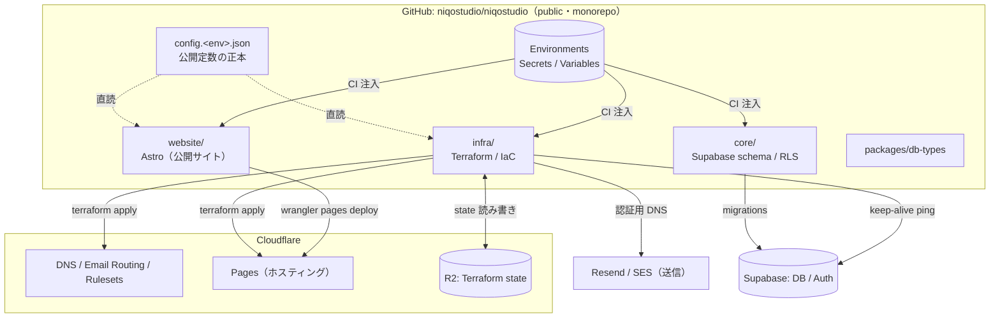
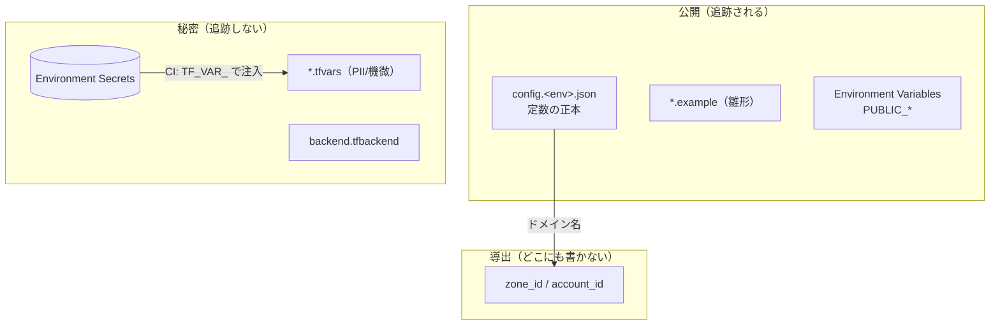

# アーキテクチャ

> **責務**：全体像を**図**で示す（システム / 秘密境界 / CI）。変数の置き場の一覧表は
> [variables.md](variables.md)、用語は [glossary.md](infra/glossary.md)、手順は [infra/setup.md](infra/setup.md)。

1つの monorepo（`niqostudio/niqostudio`）に website / core / infra / packages をモジュールとして持ち、
外部サービス（Cloudflare / Resend / Supabase）と連携する。モジュールは独立し、共有は root の規約・docs と、
root の `config.<env>.json`（公開定数・env ごとに1ファイル・committed）だけ。**リポ跨ぎの配布機構は持たない**。

## システム全体図

要点：
- **infra が触るのは「アカウント共有資産」だけ**（DNS・メール・Pages の箱・state）。website は Pages へ deploy、core は Supabase にスキーマ適用。
- 公開定数は **root の `config.<env>.json`（env ごとに1ファイル・committed）**。infra（Terraform）と website が直読する。
- 秘密は **GitHub Environments** でスコープし、本番反映は承認ゲートを通す。

## 値の3面（秘密境界）

値は「公開定数 / 秘密 / 導出」の3つに必ず分類する。**どこに書くか**がこれで決まる。

- **公開**：`config.<env>.json` と `*.example`、`PUBLIC_*` の Variables。誰でも見てよい。
- **秘密**：`*.tfvars`・`backend.tfbackend`・各種トークン → Environment Secret。**gitleaks で誤コミットを CI 検出**。
- **導出**：`zone_id` / `account_id` は各ドメイン名から data source で引く＝**書かない・1か所**。

## CI（モジュール別 paths）

ワークフローは root `.github/workflows/` に集約し、**paths で対象モジュールだけ起動**する。

- `website/**` → build / check（Pages へは Cloudflare 連携）。
- `core/supabase/migrations/**` → db push（push は dry-run、承認 dispatch で apply）。
- `infra/**` → fmt / validate（PR）、terraform apply（Environment `infra-production`・承認ゲート）。
- `docs/**` / `mkdocs.yml` → MkDocs build → GitHub Pages。
- 秘密値を使う本番反映は GitHub Environment（モジュール別 `<module>-production`・必須レビュー）でスコープする＝各ジョブは自分のモジュールの secret だけ読む（最小権限）。
