# スキーマ

NIQO STUDIO core のデータモデル。DDL の正本は `supabase/migrations/`、本書はそれを読みやすくまとめた参照。命名・トリガ等の共通規約は `.claude/rules/conventions.md`。

## 名前空間

業務データはすべて専用スキーマ **`core`** に置く（`public` は空にして無効化＝API 非公開・`REVOKE`）。
公開サイト（anon）が触れるのは **`core.public_*` view だけ**（生テーブルは anon REVOKE・service_role 専用）。
studio は service_role で core を読み書きし、website は anon で `public_*` view を読む。

## 設計の核

関心を分離する。

- **truth（正本）**：被写体は2種。`projects`（**有期**の客先案件＝engagement spine。`clients`・`ndas`・状態機械を伴う）と `products`（**継続**の自社プロダクト＝`active/maintained/sunset`・NDA 無し）。共通の子（`problems` / `deliverables` / `metrics`）は被写体ポリモーフィック（`project_id` xor `product_id`）。`requirements` / `scope_items` / `project_decisions` / `project_repositories` は projects 専用の子。
  - 軸は**有期性**：project は終わる（`closed`）／product は終わらない。product に有期 project がぶら下がれる（`projects.product_id`）。
- **状態機械（ライフサイクル）**：`project_statuses`（状態マスタ）＋ `project_status_transitions`（許容遷移＝辺）＋ `project_status_events`（遷移履歴）。`projects.status` はマスタ FK で、許容遷移はトリガが強制（**UI でなくデータ層で制約**）。終わり方（完了/失注/中止）は `project_outcomes` view が履歴の closed 直前から派生。
- **NDA 同意（公開可否）**：`ndas`（案件ごと・カテゴリ単位の公開フラグ）。**truth 行は publishable を持たず、公開ゲートは ndas に集約**。
- **curation**：`showcase_entries`（公開する1事例の体裁・被写体は project xor product）＋選択結合（`showcase_problems` / `showcase_deliverables` / `showcase_metrics`）。許可分から事例ごとに見せる分を選び、`display_priority` で並べる。
- **公開射影**：`core.public_showcases`（project/product を畳んで投影。`subject_kind` で識別。project は `published × 選択 × カテゴリ許可`、product は自社所有のため NDA 無しで公開）／`core.public_services`（is_active）／`core.public_profile`。website は projection で画面語彙に翻訳し、今は `/cases` に一本化（将来 `subject_kind` で `/products` 分割可）。

補足：
- **1被写体（project / product）に N 事例（`showcase_entries`）**。各事例が載せる problems/deliverables/metrics を選ぶ。
- 現状（as-is）は `problems.problem` の文脈に、目標（to-be）は `solution`＋`deliverables`＋`scope_items`＋`project_decisions` に吸収（専用列は持たない）。
- 横断的基盤（infra / IaC / CI / security）は離散成果物にせず `projects.tech_stack` に集約。
- **順序**：公開の見せ順は curation の `display_priority`（降順・大きいほど先・0=末尾）。truth 子の作業順は core が持たず studio の下書きが担う。

## レイヤと公開範囲（すべて `core` スキーマ）

| レイヤ | テーブル/ビュー | anon（公開サイト）からのアクセス |
|---|---|---|
| 🔒 truth | `clients` / `projects` / `products` / `requirements` / `problems` / `scope_items` / `project_decisions` / `deliverables` / `metrics` / `project_repositories` | 不可（REVOKE・service_role 専用） |
| 🔒 状態機械 | `project_statuses` / `project_status_transitions` / `project_status_events` | 不可 |
| 🔒 NDA | `ndas` | 不可（公開可否の正本・projects 専用） |
| 🔒 curation | `showcase_entries` / `showcase_problems` / `showcase_deliverables` / `showcase_metrics` | 不可 |
| 📥 リード | `inquiries` | 不可（INSERT は最小権限ロール `inquiry_writer`・anon は不可） |
| 📋 業務記録 | `meetings` / `work_logs` | 不可（内部運用・service_role 専用） |
| 👤 担当者 | `contacts` | 不可（顧客担当者＝人・内部運用・service_role 専用） |
| ✉ 返信ログ | `inquiry_replies` | 不可（送信した返信の append-only ログ・内部） |
| ⚙ マスタ | `metric_definitions` | 不可（指標カタログ・内部・studio で編集） |
| 📈 計測ログ | `metric_measurements` | 不可（指標の時系列・推移の正本・内部・append-only） |
| 🌐 公開 view | `public_showcases` | SELECT 可（project は `published` × 選択 × カテゴリ許可、product は `published` × 選択・owner 投影） |
| 🌐 公開 view | `public_services` | SELECT 可（`is_active = true` の投影） |
| 🌐 公開 view | `public_profile` | SELECT 可（singleton の投影） |

`core` には anon の Supabase 既定権限が無く、明示した `public_*` view にだけ SELECT を付与する（生テーブルは REVOKE・RLS も deny 既定＝多層防御）。公開 view は owner 所有の“定義者”view（公開列を定義で固定）。`project_outcomes` は内部 view（service_role）。

## ER 図

```mermaid
erDiagram
    clients      ||--o{ projects          : "client_id"
    services     ||--o{ projects          : "service_id (任意)"
    products     ||--o{ projects          : "product_id (任意・有期 project)"
    project_statuses ||--o{ projects      : "status (FK→code)"
    project_statuses ||--o{ project_status_transitions : "from/to_status"
    projects     ||--o{ project_status_events : "project_id"
    clients      ||--o{ inquiries         : "converted_client_id"
    clients      ||--o{ contacts          : "client_id (任意)"
    clients      ||--o{ meetings          : "client_id (任意)"
    projects     ||--o{ meetings          : "project_id (任意)"
    inquiries    ||--o{ meetings          : "inquiry_id (任意)"
    inquiries    ||--o{ inquiry_replies   : "inquiry_id"
    projects     ||--o{ work_logs         : "project_id"
    projects     ||--|| ndas              : "project_id (1:1)"
    projects     ||--o{ requirements      : "project_id"
    projects     ||--o{ scope_items       : "project_id"
    projects     ||--o{ project_decisions : "project_id"
    projects     ||--o{ project_repositories : "project_id"
    projects     ||--o{ problems          : "project_id (xor product_id)"
    products     ||--o{ problems          : "product_id (xor project_id)"
    projects     ||--o{ deliverables      : "project_id (xor product_id)"
    products     ||--o{ deliverables      : "product_id (xor project_id)"
    projects     ||--o{ metrics           : "project_id (xor product_id)"
    products     ||--o{ metrics           : "product_id (xor project_id)"
    deliverables ||--o{ metrics           : "deliverable_id (任意)"
    deliverables ||--o{ metric_measurements : "deliverable_id (任意)"
    projects     ||--o{ showcase_entries  : "project_id (xor product_id)"
    products     ||--o{ showcase_entries  : "product_id (xor project_id)"
    showcase_entries ||--o{ showcase_problems     : "showcase_id"
    problems         ||--o{ showcase_problems     : "problem_id"
    showcase_entries ||--o{ showcase_deliverables : "showcase_id"
    deliverables     ||--o{ showcase_deliverables : "deliverable_id"
    showcase_entries ||--o{ showcase_metrics      : "showcase_id"
    metrics          ||--o{ showcase_metrics      : "metric_id"
```



`public_showcases`(view) は `showcase_entries`(published) を被写体（`projects`＋`ndas`＋`clients`、または `products`）・選択した `problems`/`deliverables`/`metrics` と結合して投影する。

## テーブル定義

各表に共通の `id`（profile を除き uuid PK）・`created_at`・`updated_at` は末尾の[共通カラム](#共通カラム)を参照（結合表は `created_at` のみ）。

### clients（truth・顧客マスタ）
顧客の正本。anon は直読み不可（公開表示は `public_showcases` view が `client_display` × `is_public_name_allowed` で解決）。

| 列 | 型 | 備考 |
|---|---|---|
| `slug` | text UNIQUE NOT NULL | |
| `public_name` | text NOT NULL | 公開表示名（実名NGなら伏せ名） |
| `real_name` | text | 内部専用 |
| `is_public_name_allowed` | boolean NOT NULL | 既定 false（公開実名の同意） |
| `industry` | text NOT NULL | 業種 |
| `size` / `description` / `logo_url` / `website_url` / `first_contact_date` | – | |
| `internal_notes` | text | 内部専用 |

### projects（truth・案件＝engagement spine）
受注した仕事の記録。status で段階を持ち、実態は子テーブルにぶら下げる。1顧客に複数案件。公開しない。

| 列 | 型 | 備考 |
|---|---|---|
| `client_id` | uuid FK→clients | null 可（自主プロジェクト） |
| `product_id` | uuid FK→products | 任意・ON DELETE SET NULL（自社製品開発の有期 project を product に紐付け） |
| `service_id` | uuid FK→services | 任意・ON DELETE SET NULL（提供サービスへの単一リンク） |
| `title` | text NOT NULL | |
| `status` | text NOT NULL・FK→project_statuses | consultation / discovery / active / delivered / closed（既定 consultation・遷移はトリガで強制） |
| `tech_stack` | text[] NOT NULL | 技術＋**横断的基盤**（infra/IaC/CI/security はここ） |
| `testimonial` | jsonb | `{quote, role}`（公開は `ndas.publish_testimonial` で制御） |
| `started_on` / `ended_on` | date | 着手 / 実終了（CHECK: ended_on ≥ started_on） |
| `due_on` | date | 計画上の終了（有期性の明示） |
| `contract_value` | integer | 受注額（**税抜**・JPY・CHECK ≥ 0・null=未確定）。消費税は請求時に当時の税率で別計算する（→ 将来 invoices）。公開しない。 |
| `internal_notes` | text | |

### products（truth・自社プロダクト＝継続実体）
自社所有で継続的に開発・運用する実体（公開システム・自社製品）。project と違い**完了状態を持たない**（active/maintained/sunset）。client・NDA を持たず、公開事例は自社所有のため NDA ゲート無し。`problems`/`deliverables`/`metrics`/`showcase_entries` を子に持つ（被写体ポリモーフィック）。

| 列 | 型 | 備考 |
|---|---|---|
| `slug` | text UNIQUE NOT NULL | |
| `name` | text NOT NULL | |
| `summary` | text | |
| `status` | text NOT NULL | active / maintained / sunset（既定 active・終端＝完了は無い） |
| `tech_stack` | text[] NOT NULL | 技術＋横断的基盤 |
| `launched_on` | date | 公開・運用開始 |
| `internal_notes` | text | 内部専用 |

### project_statuses / project_status_transitions / project_status_events（状態機械）
案件ライフサイクルを「状態マスタ × 許容遷移 × 履歴」でデータ層に持つ。`projects.status` は `project_statuses.code` への FK。

- **project_statuses**（状態マスタ）：`code`(text PK) / `label` / `sort_order`(パイプラインのシーケンス・昇順) / `is_initial` / `is_terminal`。値＝`consultation`(無料相談・初期) → `discovery`(事前設計) → `active`(進行) → `delivered`(納品) → `closed`(終端)。
- **project_status_transitions**（許容遷移＝辺）：`from_status` / `to_status`（複合 PK・自己遷移禁止）。BEFORE UPDATE トリガが `from→to` を検証し違反を拒否（INSERT は FK のみ＝任意状態で作成可＝backfill）。
- **project_status_events**（履歴・append-only）：`project_id`(FK・CASCADE) / `from_status`(初期は null) / `to_status` / `changed_at`。AFTER トリガが status 変化を記録（監査・ファネル計測）。

`project_outcomes`（内部 view）：`status='closed'` のとき履歴の closed 直前状態から終わり方を派生（delivered→`completed` / active→`cancelled` / それ以前→`lost`）。

### project_repositories（truth・進行中開発の正本リポ）
案件の開発が行われる git リポ（project 1:N）。`deliverables`（顧客への納品物）とは別概念。内部のみ。

| 列 | 型 | 備考 |
|---|---|---|
| `project_id` | uuid FK→projects | NOT NULL・CASCADE |
| `url` | text NOT NULL | |
| `role` | text | 役割ラベル（monorepo / site / infra 等・自由記述） |
| `visibility` | text NOT NULL | public / private（既定 private） |

### requirements（truth・すり合わせの生の要望）
ヒアリング段階の顧客要望（非エンジニア語彙）。1案件:N。as-is/to-be/decisions の素材。内部のみ。

| 列 | 型 | 備考 |
|---|---|---|
| `project_id` | uuid FK→projects | NOT NULL・CASCADE |
| `content` | text NOT NULL | 要望そのもの |
| `note` | text | |

### problems（truth・課題→対応→結果）
課題と対応のペア＋結果。1案件:N。現状（as-is）は `problem` の文脈に含む。公開は選択（`showcase_problems`）× `ndas.publish_problems`。

| 列 | 型 | 備考 |
|---|---|---|
| `project_id` / `product_id` | uuid FK→projects / products | CASCADE・**どちらか一方**（CHECK num_nonnulls=1） |
| `problem` | text NOT NULL | 課題（現状の文脈を含む） |
| `solution` | text | 対応・アプローチ |
| `outcome` | text | 結果（定性。定量は metrics） |

### scope_items（truth・作る/作らない）
to-be 配下の細かいスコープ判断。`included=true` で作る、false で見送り（「作らない」も判断＝価値）。内部のみ。

| 列 | 型 | 備考 |
|---|---|---|
| `project_id` | uuid FK→projects | NOT NULL・CASCADE |
| `item` | text NOT NULL | 対象 |
| `included` | boolean NOT NULL | true=作る / false=作らない |
| `note` | text | |

### project_decisions（truth・設計判断＝ADR）
案件の設計判断ログ。`topic` は独立論点（要望と 1:1 ではない）。内部のみ。

| 列 | 型 | 備考 |
|---|---|---|
| `project_id` | uuid FK→projects | NOT NULL・CASCADE |
| `topic` | text NOT NULL | 何についての判断か |
| `decision` | text NOT NULL | 判断（採用/見送り＋内容） |
| `rationale` | text | なぜ |
| `internal_notes` | text | 機微な理由（内部専用） |
| `status` | text NOT NULL | accepted / superseded（既定 accepted） |
| `superseded_by` | uuid FK→project_decisions | 任意・ON DELETE SET NULL（撤回チェーン） |

### deliverables（truth・離散 OUTPUT）
案件で作った「名前の付く成果物」（site/system/docs 等）。横断的基盤は含めない（→ `projects.tech_stack`）。公開は選択 × `ndas.publish_deliverables`。

| 列 | 型 | 備考 |
|---|---|---|
| `project_id` / `product_id` | uuid FK→projects / products | CASCADE・**どちらか一方**（CHECK num_nonnulls=1） |
| `kind` | text NOT NULL | 緩い分類（public_web / cms / business_system / app / docs …。厳密 enum にしない） |
| `name` | text NOT NULL | |
| `description` | text | |
| `url` | text | 公開先（あれば。事例の「公開リンク」はここ由来） |
| `image_urls` | text[] NOT NULL | 成果物スクショ |

### metrics（truth・測定の正本）
結果（`achieved`）と任意の `previous`（過去値）/ `goal`（目標値）を1か所で持つ。公開は `previous`→`achieved`（Before/After）のみ。`goal` は内部の目標管理用で**公開 view には出さない**。事業 KPI は `deliverable_id` null。公開は選択 × `ndas.publish_metrics`。

| 列 | 型 | 備考 |
|---|---|---|
| `project_id` / `product_id` | uuid FK→projects / products | CASCADE・**どちらか一方**（CHECK num_nonnulls=1） |
| `deliverable_id` | uuid FK→deliverables | 任意・ON DELETE SET NULL |
| `label` | text NOT NULL | |
| `achieved` | text NOT NULL | 結果（フロントは After） |
| `previous` | text | 過去値（フロントは Before） |
| `goal` | text | 目標値。**内部のみ（view 非露出）** |
| `unit` | text | |
| `kind` | text NOT NULL | technical / business（既定 business） |

### ndas（NDA 同意・公開可否の正本）
案件ごと（1:1）の公開可否合意。truth 行は publishable を持たず、**公開ゲートはここに集約**（カテゴリ単位）。合意の確認＝チェックリスト。ndas が無い案件は全カテゴリ非公開（fail-safe）。

| 列 | 型 | 備考 |
|---|---|---|
| `project_id` | uuid FK→projects | NOT NULL・UNIQUE・CASCADE |
| `reference` | text | NDA 文書ポインタ |
| `agreed_on` | date | 合意日 |
| `status` | text NOT NULL | draft / agreed（既定 draft） |
| `notes` | text | |
| `publish_problems` | boolean NOT NULL | 既定 false |
| `publish_deliverables` | boolean NOT NULL | 既定 false |
| `publish_metrics` | boolean NOT NULL | 既定 false |
| `publish_testimonial` | boolean NOT NULL | 既定 false |

※ 顧客名の公開可否は `clients.is_public_name_allowed`。

### showcase_entries（curation・公開する1事例）
front 表示の体裁＋選択。物語の本体は被写体（projects/products）の子。被写体に 1:N。`client_display` は project 被写体のみ有効（product 時は view が client を出さない）。

| 列 | 型 | 備考 |
|---|---|---|
| `project_id` / `product_id` | uuid FK→projects / products | CASCADE・**どちらか一方**（CHECK num_nonnulls=1） |
| `slug` | text UNIQUE NOT NULL | |
| `title` | text NOT NULL | 公開見出し |
| `summary` | text | 公開リード |
| `thumbnail_url` | text | カードのヒーロー画像 |
| `period` | text | 表示用の期間 |
| `client_display` | text NOT NULL | named / anonymized / hidden（既定 anonymized） |
| `status` | text NOT NULL | draft / published / archived |
| `display_priority` | integer NOT NULL | 公開の見せ順（降順・大きいほど先・0=末尾） |

### showcase_problems / showcase_deliverables / showcase_metrics（curation・選択結合）
事例ごとに「公開する課題・成果物・数値」を選ぶ（複製ゼロ・公開粒度の制御）。

| 列 | 型 |
|---|---|
| `showcase_id` | uuid FK→showcase_entries CASCADE |
| `problem_id` / `deliverable_id` / `metric_id` | uuid FK→problems / deliverables / metrics CASCADE |
| `display_priority` | integer NOT NULL（公開の見せ順・降順） |

PK は (`showcase_id`, `problem_id`) / (`showcase_id`, `deliverable_id`) / (`showcase_id`, `metric_id`)。

### public_showcases（公開・view）
`showcase_entries(published)` の投影。anon に SELECT 付与（公開面の view）。website では `cases`（ケーススタディ）として読む。被写体は project / product を畳む（`subject_kind` で識別）。**project はカテゴリ公開可否を `ndas` で制御、product は自社所有のため NDA 無しで公開**（owned＝選択分を常に出す）。

| 列 | 内容 |
|---|---|
| `slug` / `title` / `summary` / `thumbnail_url` / `period` / `display_priority` / `project_id` / `product_id` | showcase_entries 由来 |
| `subject_kind` | `product_id` 有り＝`product` / それ以外＝`project` |
| `tech_stack` | 被写体（project または product）由来 |
| `testimonial` | project かつ `ndas.publish_testimonial` のときだけ testimonial、他は null（product は常に null） |
| `client_name` | project かつ `client_display='named' AND is_public_name_allowed` のときだけ `public_name`、他は null（product は null） |
| `client_industry` | project かつ `client_display ∈ {named, anonymized}` のとき industry、他は null（product は null） |
| `problems` | product、または project かつ `ndas.publish_problems` のとき、選択分の集約 `[{problem,solution,outcome}]`（他は `[]`） |
| `deliverables` | product、または project かつ `ndas.publish_deliverables` のとき、選択分の集約 `[{kind,name,url,images}]`（他は `[]`） |
| `metrics` | product、または project かつ `ndas.publish_metrics` のとき、選択分の集約 `[{label,achieved,previous,unit,kind}]`（goal 除外。他は `[]`） |

### services（提供サービス）
業務 truth。anon は直読み不可で、公開は `core.public_services` view（`is_active=true` の投影）が担う。

| 列 | 型 | 備考 |
|---|---|---|
| `slug` | text UNIQUE NOT NULL | |
| `name` / `name_ja` | text | 正準名（英）／和名 |
| `headline` / `summary` | text | |
| `target_pains` / `coverage` / `deliverables` / `followups` / `exclusions` | text[] NOT NULL | |
| `details` | text | |
| `pricing` | jsonb | 表示用（下記） |
| `price_min` | integer | 機械可読の最小額 |
| `currency` | text NOT NULL | 既定 'JPY' |
| `duration` | text | |
| `display_priority` | integer NOT NULL | 公開の見せ順（降順・大きいほど先・既定 0=末尾） |
| `is_active` | boolean NOT NULL | 既定 true |

### profile（プロフィール、singleton）
業務 truth（`id='singleton'` 固定で1行・屋号/ブランドの正本）。公開は `core.public_profile` view が担う。

| 列 | 型 | 備考 |
|---|---|---|
| `id` | text PK | 既定 'singleton'（CHECK で固定） |
| `display_name` / `handle` | text NOT NULL | |
| `bio` / `tagline` / `operation_policy` / `contact_email` | text | |
| `skills` | text[] NOT NULL | |
| `social_links` | jsonb NOT NULL | `[{label, url}]` |
| `logo_svg` | text | SVG 本体（website でインライン・`currentColor` 配色・信頼済み前提） |

※ profile は `updated_at` のみ（`created_at` なし）。

### inquiries（リード・問い合わせ）
公開フォーム受付。anon は INSERT 不可（最小権限ロール `inquiry_writer` 経由）。到達状況は webhook が更新。詳細は `20260604000300_inquiry_delivery_tracking.sql`。

| 列 | 型 | 備考 |
|---|---|---|
| `name` / `email` / `message` | text NOT NULL | |
| `company` / `subject` | text | |
| `status` | text NOT NULL | new / responded / converted / archived |
| `auto_reply_id` | text | 自動返信の相関キー |
| `delivery_status` | text NOT NULL | pending / delivered / bounced |
| `converted_client_id` | uuid FK→clients | 内部運用 |
| `internal_notes` | text | 内部運用 |

### meetings（業務記録・打ち合わせ）
顧客・案件・問い合わせ（無料相談）のいずれにも紐付けられる打ち合わせ記録。内部のみ。status は予定/実施済/中止の区分で、案件のような状態機械は持たない。

| 列 | 型 | 備考 |
|---|---|---|
| `client_id` | uuid FK→clients | 任意・ON DELETE CASCADE（顧客の打ち合わせ） |
| `project_id` | uuid FK→projects | 任意・ON DELETE SET NULL（案件文脈） |
| `inquiry_id` | uuid FK→inquiries | 任意・ON DELETE SET NULL（無料相談＝問い合わせ由来。顧客化せず紐付け） |
| `title` | text NOT NULL | 議題 |
| `met_on` | date NOT NULL | 打ち合わせ日（既定 current_date） |
| `duration_min` | integer | 所要時間（分・CHECK > 0） |
| `status` | text NOT NULL | scheduled / done / canceled（既定 scheduled） |
| `location` | text | 場所 / オンライン URL |
| `notes` | text | 議事録 |

### work_logs（業務記録・工数）
案件に対する作業時間の記録（project 1:N）。内部のみ。集計で案件別の総工数・粗利（`contract_value` ÷ 工数）に使う。

| 列 | 型 | 備考 |
|---|---|---|
| `project_id` | uuid FK→projects | NOT NULL・CASCADE |
| `worked_on` | date NOT NULL | 作業日（既定 current_date） |
| `hours` | numeric(5,2) NOT NULL | 工数（時間・CHECK > 0） |
| `task` | text NOT NULL | 作業内容 |
| `note` | text | メモ |

### contacts（CRM・顧客担当者）
会社（clients）に紐づく担当者（人）。1会社:N。問い合わせから変換で作られ、案件化で会社に割り当てる。内部のみ。

| 列 | 型 | 備考 |
|---|---|---|
| `client_id` | uuid FK→clients | 任意・ON DELETE SET NULL（会社未割当でも持てる） |
| `name` | text NOT NULL | 氏名 |
| `email` / `phone` / `role` | text | 連絡先・役職 |
| `notes` | text | メモ |

### inquiry_replies（業務記録・問い合わせ返信ログ）
問い合わせへ studio から送った返信の append-only ログ（スレッド表示の正本）。受信は取り込まないため送信のみ。内部のみ。

| 列 | 型 | 備考 |
|---|---|---|
| `inquiry_id` | uuid FK→inquiries | NOT NULL・CASCADE |
| `body` | text NOT NULL | 返信本文 |

※ `created_at` のみ（更新しない append-only）。

### metric_definitions（マスタ・指標カタログ）
メトリクスのカタログ。機械的（technical・スクリプト測定可）/ ビジネス（business・手動＋測り方）を区別。studio で編集。metrics（値）は参照せず、反映時に label/unit/kind をコピーする。

| 列 | 型 | 備考 |
|---|---|---|
| `key` | text UNIQUE NOT NULL | スクリプト測定の対応キー |
| `label` | text NOT NULL | 指標名 |
| `unit` | text | 単位 |
| `kind` | text NOT NULL | technical / business（既定 business） |
| `auto` | boolean NOT NULL | スクリプト測定可（既定 false） |
| `howto` | text | 手動の測り方（business 等） |
| `sort_order` / `is_active` | integer / boolean | 並び順・有効 |

### metric_measurements（計測ログ・推移）
指標の計測を時系列で残す append-only ログ（推移グラフの正本）。被写体（案件 xor プロダクト）＋成果物（任意）＋指標 key。旧サイトは公開前に1回、納品物は期間中に何度も測れる＝after が推移する。

| 列 | 型 | 備考 |
|---|---|---|
| `project_id` / `product_id` | uuid FK | **どちらか一方**（CHECK num_nonnulls=1）・CASCADE |
| `deliverable_id` | uuid FK→deliverables | 任意・ON DELETE SET NULL |
| `metric_key` | text NOT NULL | 指標のキー（metric_definitions.key） |
| `phase` | text NOT NULL | before / after |
| `value` | text NOT NULL | 計測値 |
| `url` | text | 測定 URL（自動測定時） |

※ `measured_at` のみ（append-only）。

## status の値

| テーブル | カラム | 値 |
|---|---|---|
| `projects` | `status` | consultation / discovery / active / delivered / closed（`project_statuses` FK・遷移はトリガ強制） |
| `products` | `status` | active / maintained / sunset（終端＝完了は無い） |
| `ndas` | `status` | draft / agreed |
| `project_decisions` | `status` | accepted / superseded |
| `scope_items` | `included` | boolean（true=作る） |
| `showcase_entries` | `status` | draft / published / archived |
| `showcase_entries` | `client_display` | named / anonymized / hidden |
| `metrics` | `kind` | technical / business |
| `inquiries` | `status` | new / responded / converted / archived |
| `inquiries` | `delivery_status` | pending / delivered / bounced |
| `meetings` | `status` | scheduled / done / canceled |
| `services` | `is_active` | boolean |

## jsonb 構造

| カラム | 形 |
|---|---|
| `projects.testimonial` | `{ "quote": string, "role": string \| null }` |
| `public_showcases.problems`（view） | `[{ "problem": string, "solution": string\|null, "outcome": string\|null }]` |
| `public_showcases.deliverables`（view） | `[{ "kind": string, "name": string, "url": string\|null, "images": string[] }]` |
| `public_showcases.metrics`（view） | `[{ "label": string, "achieved": string, "previous": string\|null, "unit": string\|null, "kind": string }]` |
| `profile.social_links` | `[{ "label": string, "url": string }]` |

`services.pricing`:

```ts
{
  base_price?: string;
  factors?: { name: string; price: string }[];
  average_range?: string;
  median?: string;
  tiers?: { name: string; price: string; scope?: string; hours?: number }[];
  notes?: string;
}
```

## 共通カラム

全テーブルに `id`（profile を除き `uuid PRIMARY KEY DEFAULT gen_random_uuid()`）、`created_at` / `updated_at`（`timestamptz NOT NULL DEFAULT now()`。profile は `updated_at` のみ、結合表は `created_at` のみ）。`updated_at` は `set_updated_at()` トリガで自動更新。
