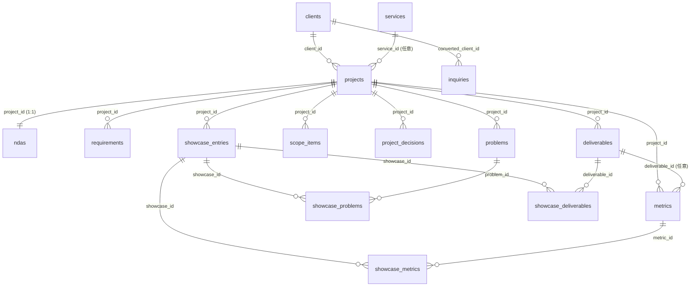

# スキーマ

NIQO STUDIO core のデータモデル。DDL の正本は `supabase/migrations/`、本書はそれを読みやすくまとめた参照。命名・トリガ等の共通規約は `.claude/rules/conventions.md`。

## 設計の核

4つの関心を分離する。

- **truth（正本）**：`projects` ＋ 子（`requirements` / `problems` / `scope_items` / `project_decisions` / `deliverables` / `metrics`）＋ `clients`。案件の全事実。anon 直読み不可。
- **NDA 同意（公開可否）**：`ndas`（案件ごと・カテゴリ単位の公開フラグ）。**truth 行は publishable を持たず、公開ゲートは ndas に集約**。
- **curation**：`showcase_entries`（公開する1事例の front 体裁）＋選択結合（`showcase_problems` / `showcase_deliverables` / `showcase_metrics`）。許可されたものから事例ごとに見せる分を選ぶ。
- **公開**：単一 view `showcases`（owner 権限で `published × 選択 × カテゴリ許可` を投影）。website は「ケーススタディ（/cases）」へ projection で翻訳（DB は showcase 語彙で一貫）。

補足：
- **1案件（project）に N 事例（`showcase_entries`）**。各事例が載せる problems/deliverables/metrics を選ぶ。
- 現状（as-is）は `problems.problem` の文脈に、目標（to-be）は `solution`＋`deliverables`＋`scope_items`＋`project_decisions` に吸収（専用列は持たない）。
- 横断的基盤（infra / IaC / CI / security）は離散成果物にせず `projects.tech_stack` に集約。
- 案件の総括（retrospective）は実績が貯まってから projects に追加（将来）。

## レイヤと公開範囲

| レイヤ | テーブル/ビュー | anon（公開サイト）からのアクセス |
|---|---|---|
| 🔒 truth | `clients` | 不可（view が同意解決して公開） |
| 🔒 truth | `projects` / `requirements` / `problems` / `scope_items` / `project_decisions` / `deliverables` / `metrics` | 不可 |
| 🔒 NDA | `ndas` | 不可（公開可否の正本） |
| 🔒 curation | `showcase_entries` / `showcase_problems` / `showcase_deliverables` / `showcase_metrics` | 不可 |
| 🌐 公開 view | `showcases` | SELECT 可（`status='published'` × 選択 × カテゴリ許可・owner 投影） |
| 🌐 公開 | `services` | `is_active = true` を SELECT |
| 🌐 公開 | `profile` | SELECT 可（singleton） |
| 📥 リード | `inquiries` | INSERT のみ（最小権限ロール）・SELECT 不可 |

内部表は RLS 有効＋`REVOKE ALL FROM anon, authenticated`（多層防御）。`showcases` は owner 所有の“定義者”view（公開列を view 定義で固定）。

## ER 図



`showcases`(view) は `showcase_entries`(published) を `projects`・`ndas`・選択した `problems`/`deliverables`/`metrics`・`clients` と結合して投影する。

## テーブル定義

各表に共通の `id`（profile を除き uuid PK）・`created_at`・`updated_at` は末尾の[共通カラム](#共通カラム)を参照（結合表は `created_at` のみ）。

### clients（truth・顧客マスタ）
顧客の正本。anon は直読み不可（公開表示は `showcases` view が `client_display` × `is_public_name_allowed` で解決）。

| 列 | 型 | 備考 |
|---|---|---|
| `slug` | text UNIQUE NOT NULL | |
| `public_name` | text NOT NULL | 公開表示名（実名NGなら伏せ名） |
| `real_name` | text | 内部専用 |
| `is_public_name_allowed` | boolean NOT NULL | 既定 false（公開実名の同意） |
| `industry` | text NOT NULL | 業種 |
| `size` / `description` / `logo_url` / `website_url` / `first_contact_date` | – | |
| `internal_notes` | text | 内部専用 |
| `display_order` | integer NOT NULL | 既定 0 |

### projects（truth・案件＝engagement spine）
受注した仕事の記録。status で段階を持ち、実態は子テーブルにぶら下げる。1顧客に複数案件。公開しない。

| 列 | 型 | 備考 |
|---|---|---|
| `client_id` | uuid FK→clients | null 可（自主プロジェクト） |
| `service_id` | uuid FK→services | 任意・ON DELETE SET NULL（提供サービスへの単一リンク） |
| `title` | text NOT NULL | |
| `status` | text NOT NULL | discovery / active / delivered / maintenance / closed |
| `tech_stack` | text[] NOT NULL | 技術＋**横断的基盤**（infra/IaC/CI/security はここ） |
| `testimonial` | jsonb | `{quote, role}`（公開は `ndas.publish_testimonial` で制御） |
| `started_on` / `ended_on` | date | |
| `internal_notes` | text | |

### requirements（truth・すり合わせの生の要望）
ヒアリング段階の顧客要望（非エンジニア語彙）。1案件:N。as-is/to-be/decisions の素材。内部のみ。

| 列 | 型 | 備考 |
|---|---|---|
| `project_id` | uuid FK→projects | NOT NULL・CASCADE |
| `content` | text NOT NULL | 要望そのもの |
| `note` | text | |
| `display_order` | integer NOT NULL | |

### problems（truth・課題→対応→結果）
課題と対応のペア＋結果。1案件:N。現状（as-is）は `problem` の文脈に含む。公開は選択（`showcase_problems`）× `ndas.publish_problems`。

| 列 | 型 | 備考 |
|---|---|---|
| `project_id` | uuid FK→projects | NOT NULL・CASCADE |
| `problem` | text NOT NULL | 課題（現状の文脈を含む） |
| `solution` | text | 対応・アプローチ |
| `outcome` | text | 結果（定性。定量は metrics） |
| `display_order` | integer NOT NULL | |

### scope_items（truth・作る/作らない）
to-be 配下の細かいスコープ判断。`included=true` で作る、false で見送り（「作らない」も判断＝価値）。内部のみ。

| 列 | 型 | 備考 |
|---|---|---|
| `project_id` | uuid FK→projects | NOT NULL・CASCADE |
| `item` | text NOT NULL | 対象 |
| `included` | boolean NOT NULL | true=作る / false=作らない |
| `note` | text | |
| `display_order` | integer NOT NULL | |

### project_decisions（truth・設計判断＝ADR）
案件の設計判断ログ。`topic` は独立論点（要望と 1:1 ではない）。内部のみ。

| 列 | 型 | 備考 |
|---|---|---|
| `project_id` | uuid FK→projects | NOT NULL・CASCADE |
| `topic` | text NOT NULL | 何についての判断か |
| `decision` | text NOT NULL | 判断（採用/見送り＋内容） |
| `rationale` | text | なぜ |
| `internal_notes` | text | 機微な理由（内部専用） |
| `status` | text NOT NULL | accepted / superseded（既定 accepted） |
| `superseded_by` | uuid FK→project_decisions | 任意・ON DELETE SET NULL（撤回チェーン） |
| `display_order` | integer NOT NULL | |

### deliverables（truth・離散 OUTPUT）
案件で作った「名前の付く成果物」（site/system/docs 等）。横断的基盤は含めない（→ `projects.tech_stack`）。公開は選択 × `ndas.publish_deliverables`。

| 列 | 型 | 備考 |
|---|---|---|
| `project_id` | uuid FK→projects | NOT NULL・CASCADE |
| `kind` | text NOT NULL | 緩い分類（public_web / cms / business_system / app / docs …。厳密 enum にしない） |
| `name` | text NOT NULL | |
| `description` | text | |
| `url` | text | 公開先（あれば。事例の「公開リンク」はここ由来） |
| `image_urls` | text[] NOT NULL | 成果物スクショ |
| `display_order` | integer NOT NULL | |

### metrics（truth・測定の正本）
結果（`achieved`）と任意の `previous`（過去値）/ `goal`（目標値）を1か所で持つ。公開は `previous`→`achieved`（Before/After）のみ。`goal` は内部の目標管理用で**公開 view には出さない**。事業 KPI は `deliverable_id` null。公開は選択 × `ndas.publish_metrics`。

| 列 | 型 | 備考 |
|---|---|---|
| `project_id` | uuid FK→projects | NOT NULL・CASCADE |
| `deliverable_id` | uuid FK→deliverables | 任意・ON DELETE SET NULL |
| `label` | text NOT NULL | |
| `achieved` | text NOT NULL | 結果（フロントは After） |
| `previous` | text | 過去値（フロントは Before） |
| `goal` | text | 目標値。**内部のみ（view 非露出）** |
| `unit` | text | |
| `kind` | text NOT NULL | technical / business（既定 business） |
| `display_order` | integer NOT NULL | |

### ndas（NDA 同意・公開可否の正本）
案件ごと（1:1）の公開可否合意。truth 行は publishable を持たず、**公開ゲートはここに集約**（カテゴリ単位）。合意の確認＝チェックリスト。ndas が無い案件は全カテゴリ非公開（fail-safe）。

| 列 | 型 | 備考 |
|---|---|---|
| `project_id` | uuid FK→projects | NOT NULL・UNIQUE・CASCADE |
| `reference` | text | NDA 文書ポインタ |
| `agreed_on` | date | 合意日 |
| `status` | text NOT NULL | draft / agreed（既定 draft） |
| `notes` | text | |
| `publish_problems` | boolean NOT NULL | 既定 false |
| `publish_deliverables` | boolean NOT NULL | 既定 false |
| `publish_metrics` | boolean NOT NULL | 既定 false |
| `publish_testimonial` | boolean NOT NULL | 既定 false |

※ 顧客名の公開可否は `clients.is_public_name_allowed`。

### showcase_entries（curation・公開する1事例）
front 表示の体裁＋選択。物語の本体は projects/problems。project に 1:N。

| 列 | 型 | 備考 |
|---|---|---|
| `project_id` | uuid FK→projects | NOT NULL・CASCADE |
| `slug` | text UNIQUE NOT NULL | |
| `title` | text NOT NULL | 公開見出し |
| `summary` | text | 公開リード |
| `thumbnail_url` | text | カードのヒーロー画像 |
| `period` | text | 表示用の期間 |
| `client_display` | text NOT NULL | named / anonymized / hidden（既定 anonymized） |
| `status` | text NOT NULL | draft / published / archived |
| `display_order` | integer NOT NULL | |

### showcase_problems / showcase_deliverables / showcase_metrics（curation・選択結合）
事例ごとに「公開する課題・成果物・数値」を選ぶ（複製ゼロ・公開粒度の制御）。

| 列 | 型 |
|---|---|
| `showcase_id` | uuid FK→showcase_entries CASCADE |
| `problem_id` / `deliverable_id` / `metric_id` | uuid FK→problems / deliverables / metrics CASCADE |
| `display_order` | integer NOT NULL |

PK は (`showcase_id`, `problem_id`) / (`showcase_id`, `deliverable_id`) / (`showcase_id`, `metric_id`)。

### showcases（公開・view）
`showcase_entries(published)` の投影。anon に SELECT 付与。website では `cases`（ケーススタディ）として読む。公開可否は `ndas` のカテゴリ同意で制御。

| 列 | 内容 |
|---|---|
| `slug` / `title` / `summary` / `thumbnail_url` / `period` / `display_order` / `project_id` | showcase_entries 由来 |
| `tech_stack` | project 由来（常時） |
| `testimonial` | `ndas.publish_testimonial` のときだけ project.testimonial、他は null |
| `client_name` | `client_display='named' AND is_public_name_allowed` のときだけ `public_name`、他は null |
| `client_industry` | `client_display ∈ {named, anonymized}` のとき industry、hidden は null |
| `problems` | `ndas.publish_problems` のとき、選択分の集約 `[{problem,solution,outcome}]`（他は `[]`） |
| `deliverables` | `ndas.publish_deliverables` のとき、選択分の集約 `[{kind,name,url,images}]`（他は `[]`） |
| `metrics` | `ndas.publish_metrics` のとき、選択分の集約 `[{label,achieved,previous,unit,kind}]`（goal 除外。他は `[]`） |

### services（公開・提供サービス）
`is_active=true` のみ公開。

| 列 | 型 | 備考 |
|---|---|---|
| `slug` | text UNIQUE NOT NULL | |
| `name` / `name_ja` | text | 正準名（英）／和名 |
| `headline` / `summary` | text | |
| `target_pains` / `coverage` / `deliverables` / `followups` / `exclusions` | text[] NOT NULL | |
| `details` | text | |
| `pricing` | jsonb | 表示用（下記） |
| `price_min` | integer | 機械可読の最小額 |
| `currency` | text NOT NULL | 既定 'JPY' |
| `duration` | text | |
| `display_order` | integer NOT NULL | |
| `is_active` | boolean NOT NULL | 既定 true |

### profile（公開・プロフィール、singleton）
`id='singleton'` 固定で1行。屋号・ブランドの正本。

| 列 | 型 | 備考 |
|---|---|---|
| `id` | text PK | 既定 'singleton'（CHECK で固定） |
| `display_name` / `handle` | text NOT NULL | |
| `bio` / `tagline` / `operation_policy` / `contact_email` | text | |
| `skills` | text[] NOT NULL | |
| `social_links` | jsonb NOT NULL | `[{label, url}]` |
| `logo_svg` | text | SVG 本体（website でインライン・`currentColor` 配色・信頼済み前提） |

※ profile は `updated_at` のみ（`created_at` なし）。

### inquiries（リード・問い合わせ）
公開フォーム受付。anon は INSERT 不可（最小権限ロール `inquiry_writer` 経由）。到達状況は webhook が更新。詳細は `20260604000300_inquiry_delivery_tracking.sql`。

| 列 | 型 | 備考 |
|---|---|---|
| `name` / `email` / `message` | text NOT NULL | |
| `company` / `subject` | text | |
| `status` | text NOT NULL | new / responded / converted / archived |
| `auto_reply_id` | text | 自動返信の相関キー |
| `delivery_status` | text NOT NULL | pending / delivered / bounced |
| `converted_client_id` | uuid FK→clients | 内部運用 |
| `internal_notes` | text | 内部運用 |

## status の値

| テーブル | カラム | 値 |
|---|---|---|
| `projects` | `status` | discovery / active / delivered / maintenance / closed |
| `ndas` | `status` | draft / agreed |
| `project_decisions` | `status` | accepted / superseded |
| `scope_items` | `included` | boolean（true=作る） |
| `showcase_entries` | `status` | draft / published / archived |
| `showcase_entries` | `client_display` | named / anonymized / hidden |
| `metrics` | `kind` | technical / business |
| `inquiries` | `status` | new / responded / converted / archived |
| `inquiries` | `delivery_status` | pending / delivered / bounced |
| `services` | `is_active` | boolean |

## jsonb 構造

| カラム | 形 |
|---|---|
| `projects.testimonial` | `{ "quote": string, "role": string \| null }` |
| `showcases.problems`（view） | `[{ "problem": string, "solution": string\|null, "outcome": string\|null }]` |
| `showcases.deliverables`（view） | `[{ "kind": string, "name": string, "url": string\|null, "images": string[] }]` |
| `showcases.metrics`（view） | `[{ "label": string, "achieved": string, "previous": string\|null, "unit": string\|null, "kind": string }]` |
| `profile.social_links` | `[{ "label": string, "url": string }]` |

`services.pricing`:

```ts
{
  base_price?: string;
  factors?: { name: string; price: string }[];
  average_range?: string;
  median?: string;
  tiers?: { name: string; price: string; scope?: string; hours?: number }[];
  notes?: string;
}
```

## 共通カラム

全テーブルに `id`（profile を除き `uuid PRIMARY KEY DEFAULT gen_random_uuid()`）、`created_at` / `updated_at`（`timestamptz NOT NULL DEFAULT now()`。profile は `updated_at` のみ、結合表は `created_at` のみ）。`updated_at` は `set_updated_at()` トリガで自動更新。
