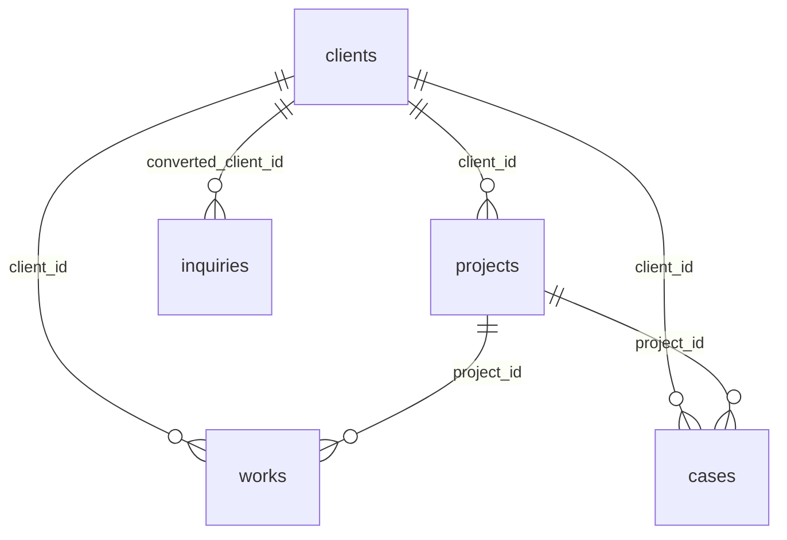

# スキーマ

NIQO STUDIO core のデータモデル。DDL の正本は `supabase/migrations/`、本書はそれを読みやすくまとめた参照。命名・トリガ等の共通規約は `.claude/rules/conventions.md`。

## レイヤと公開範囲

| レイヤ | テーブル | anon（公開サイト）からのアクセス |
|---|---|---|
| 🔒 内部 | `clients` | 列単位 SELECT（安全列のみ・公開実績に紐づく行のみ） |
| 🔒 内部 | `projects` | アクセス不可 |
| 🌐 公開 | `works` | `status = 'published'` を SELECT |
| 🌐 公開 | `cases` | `status = 'published'` を SELECT |
| 🌐 公開 | `services` | `is_active = true` を SELECT |
| 🌐 公開 | `profile` | SELECT 可（singleton） |
| 📥 リード | `inquiries` | INSERT のみ（指定列のみ）・SELECT 不可 |

アクセス制御の詳細は `supabase/migrations/20260601000100_rls.sql`。

## ER 図



- `projects` が案件の背骨。`works` / `cases` は `project_id` で案件に紐づく（同じ `project_id` を持つ `works` が「その案件の成果物」）。
- `works` / `cases` は公開表示用に `client_id`（公開帰属）も持つ。公開サイトは内部の `projects` を経由しない。
- FK はすべて `ON DELETE SET NULL`（参照先が消えても行は残す）。

## テーブル定義

各表に共通の `id`（profile を除き uuid PK）・`created_at`・`updated_at` は末尾の[共通カラム](#共通カラム)を参照（下表では割愛）。

### clients（内部・顧客マスタ）
顧客の正本。`real_name` / `internal_notes` は内部専用で anon に出さない（公開は列単位 GRANT で遮断）。公開表示名は `public_name`。

| 列 | 型 | 備考 |
|---|---|---|
| `slug` | text UNIQUE NOT NULL | |
| `public_name` | text NOT NULL | 公開表示名（実名NGなら伏せ名） |
| `real_name` | text | 内部専用（契約上の正式名） |
| `is_public_name_allowed` | boolean NOT NULL | 既定 false |
| `industry` | text NOT NULL | 業種 |
| `size` | text | 規模 |
| `description` | text | |
| `logo_url` | text | 顧客ロゴ（URL） |
| `website_url` | text | |
| `first_contact_date` | date | |
| `internal_notes` | text | 内部専用 |
| `display_order` | integer NOT NULL | 既定 0 |

### projects（内部・案件）
受注した仕事の記録・進行管理。1顧客に複数案件。公開しない。

| 列 | 型 | 備考 |
|---|---|---|
| `client_id` | uuid FK→clients | null 可（自主プロジェクト） |
| `title` | text NOT NULL | |
| `status` | text NOT NULL | discovery / active / delivered / maintenance / closed |
| `scope` | text[] NOT NULL | design / strategy / operation / devops |
| `started_on` | date | |
| `ended_on` | date | |
| `internal_notes` | text | |

### works（公開・実績）
「何を作ったか」の成果物カタログ。`status='published'` のみ公開。

| 列 | 型 | 備考 |
|---|---|---|
| `slug` | text UNIQUE NOT NULL | |
| `title` | text NOT NULL | |
| `client_id` | uuid FK→clients | 公開帰属 |
| `project_id` | uuid FK→projects | 内部案件への任意リンク |
| `period` | text | 期間（表示用） |
| `scope` | text[] NOT NULL | design / strategy / operation / devops |
| `tech_stack` | text[] NOT NULL | |
| `thumbnail_url` | text | |
| `image_urls` | text[] NOT NULL | |
| `summary` | text | |
| `public_url` | text | 公開先URL |
| `status` | text NOT NULL | draft / published / archived |
| `display_order` | integer NOT NULL | |

### cases（公開・ケーススタディ）
「どう解決し何が変わったか」の物語。`works` より詳細な読み物。同じ `project_id` の `works` がそのケースで取り上げる成果物。`status='published'` のみ公開。

| 列 | 型 | 備考 |
|---|---|---|
| `slug` | text UNIQUE NOT NULL | |
| `title` | text NOT NULL | |
| `summary` | text | 一覧カード用の短文 |
| `client_id` | uuid FK→clients | 公開帰属 |
| `project_id` | uuid FK→projects | 内部案件への任意リンク |
| `problem` | text | 課題 |
| `solution` | text | 解決策 |
| `outcome` | text | 成果 |
| `metrics` | jsonb NOT NULL | `[{label, before, after}]`（下記） |
| `tech_details` | text | MDX |
| `thumbnail_url` | text | |
| `image_urls` | text[] NOT NULL | |
| `status` | text NOT NULL | draft / published / archived |
| `published_at` | date | |
| `display_order` | integer NOT NULL | |

### services（公開・提供サービス）
`is_active=true` のみ公開。`coverage`（対応種別）と `details`（実施内容）を分離。価格は表示用 `pricing` ＋ 機械可読な `price_min`/`currency`。

| 列 | 型 | 備考 |
|---|---|---|
| `slug` | text UNIQUE NOT NULL | |
| `name` | text NOT NULL | 正準名（英） |
| `name_ja` | text | 和名 |
| `headline` | text | home カード用の短い一言 |
| `summary` | text | /services 用の説明 |
| `target_pains` | text[] NOT NULL | 解決する課題 |
| `coverage` | text[] NOT NULL | 対応種別 |
| `details` | text | 実施内容 |
| `deliverables` | text[] NOT NULL | 成果物 |
| `followups` | text[] NOT NULL | 納品後対応 |
| `exclusions` | text[] NOT NULL | 含まないもの |
| `pricing` | jsonb | 表示用（下記） |
| `price_min` | integer | 機械可読の最小額 |
| `currency` | text NOT NULL | 既定 'JPY' |
| `duration` | text | 期間（表示用） |
| `display_order` | integer NOT NULL | |
| `is_active` | boolean NOT NULL | 既定 true |

### profile（公開・プロフィール、singleton）
`id='singleton'` 固定で1行のみ。屋号・ブランドの正本。

| 列 | 型 | 備考 |
|---|---|---|
| `id` | text PK | 既定 'singleton'（CHECK で固定） |
| `display_name` | text NOT NULL | 屋号 |
| `handle` | text NOT NULL | |
| `bio` | text | |
| `skills` | text[] NOT NULL | |
| `operation_policy` | text | 運営方針 |
| `contact_email` | text | |
| `social_links` | jsonb NOT NULL | `[{label, url}]`（下記） |
| `tagline` | text | |
| `logo_svg` | text | SVG マークアップ本体（URLでなく）。website でインライン展開し `currentColor` で配色。信頼済みコンテンツ前提 |

※ profile は `updated_at` のみ（`created_at` なし）。

### inquiries（リード・問い合わせ）
公開フォームからの受付。anon は公開フィールドのみ INSERT 可。成約後に `converted_client_id` で clients に紐づける。

| 列 | 型 | 備考 |
|---|---|---|
| `name` | text NOT NULL | anon INSERT 可 |
| `company` | text | anon INSERT 可 |
| `email` | text NOT NULL | anon INSERT 可 |
| `subject` | text | anon INSERT 可 |
| `message` | text NOT NULL | anon INSERT 可 |
| `status` | text NOT NULL | new / responded / converted / archived（anon 設定不可） |
| `converted_client_id` | uuid FK→clients | 内部運用 |
| `internal_notes` | text | 内部運用 |

## status の値

| テーブル | カラム | 値 |
|---|---|---|
| `projects` | `status` | `discovery` / `active` / `delivered` / `maintenance` / `closed` |
| `works` | `status` | `draft` / `published` / `archived` |
| `cases` | `status` | `draft` / `published` / `archived` |
| `inquiries` | `status` | `new` / `responded` / `converted` / `archived` |
| `services` | `is_active` | boolean |

## jsonb 構造

| カラム | 形 |
|---|---|
| `cases.metrics` | `[{ "label": string, "before": string, "after": string }]` |
| `profile.social_links` | `[{ "label": string, "url": string }]` |

`services.pricing`:

```ts
{
  base_price?: string;
  factors?: { name: string; price: string }[];
  average_range?: string;
  median?: string;
  tiers?: { name: string; price: string; scope?: string; hours?: number }[];
  notes?: string;
}
```

## scope の値（works / projects）

`scope`（text[]）は次の組み合わせ: `design` / `strategy` / `operation` / `devops`（CHECK では強制しない運用上の規約）。

## 共通カラム

全テーブルに `id`（profile を除き `uuid PRIMARY KEY DEFAULT gen_random_uuid()`）、`created_at` / `updated_at`（`timestamptz NOT NULL DEFAULT now()`。profile は `updated_at` のみ）。`updated_at` は `set_updated_at()` トリガで自動更新。
