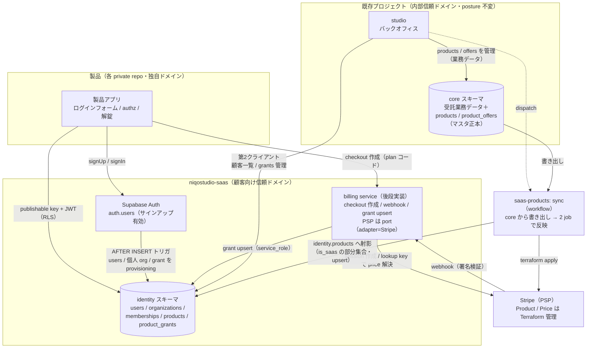
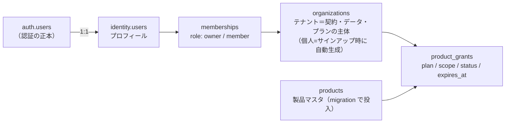
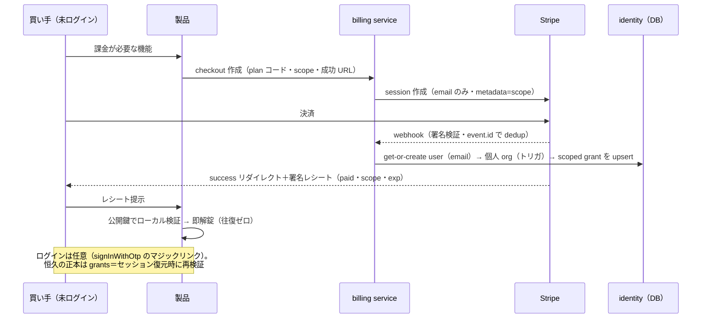

# SaaS 基盤アーキテクチャ

> **責務**：SaaS 共通基盤（アカウント・利用権・課金）の全体像を**図**で示す。
> 設計判断は [ADR 0007](../adr/0007-saas-identity-project.md)（プロジェクト分離）・
> [ADR 0008](../adr/0008-saas-billing-centralized.md)（課金集約・entitlement）、
> DB 運用は [database.md](../database.md)、変数の置き場は [variables.md](../variables.md)。

製品（各 private repo・独自ドメイン）は **niqostudio-saas** プロジェクトのアカウント・利用権に乗り、
**秘密を一切持たない**（publishable key・公開 JWKS・公開鍵のみ）。内部プロジェクト（core / studio）とは
信頼ドメインを分離し、FK でも繋がない。

## 信頼ドメイン全体図

要点：

- **秘密の非対称性が境界**。製品側にあるのは公開値のみ（URL・publishable key・JWKS・レシート検証の公開鍵）。
  service_role・PSP 鍵・レシート署名鍵は niqostudio 側（billing / studio / CI）に閉じる。
- **identity ⇄ core は FK 禁止**。受託台帳（core.clients）と SaaS テナント（organizations)は別概念。
  重なりは FK なしの参照値で表現する。
- authenticated への GRANT は identity スキーマのみ・「自分の行」だけ（RLS）。

## アカウントと利用権（entitlement）

- **製品は user_id でなく org_id をテナントキー**として扱う（チーム化・課金・複数製品に作り直しなしで進める）。
- grants は「**スコープと期限を持つ org の利用権**」：
  - サブスク：`scope=NULL`（org 全体）・status がライフサイクル（active / suspended / cancelled）
  - 一回課金：`scope=<対象キー>`（製品定義・opaque）＋ `expires_at`。再購入は同一行に upsert で延長
- 有効判定（製品側 authz）＝ `status=active かつ 未失効 かつ（scope IS NULL or scope=対象）`。

## 課金フロー（一回課金＝匿名 checkout）

- サブスクリプションは関係前提のため just-in-time ログイン（org 文脈が要る）。checkout 以降は同じ経路。
- レシートは**非対称署名（Ed25519 / ES256）の短 TTL capability**。HMAC は製品に秘密を渡すことになるため使わない。

## マスタの所有と反映経路

| マスタ | 正本 | 反映先 | 経路 |
| --- | --- | --- | --- |
| 製品（is_saas で SaaS を明示） | `core.products`（studio が管理） | `identity.products`（code/name/status の射影・is_saas の部分集合） | `saas-products: sync` workflow の identity job（upsert・消えた code は inactive 化） |
| 商品（offer・価格・**現行価格1行**） | `core.product_offers`（studio が管理） | Stripe Product / Price | 同 workflow の stripe job（書き出し → `infra/stacks/stripe` apply・lookup key = `<製品>_<offer>`） |
| redirect 允許リスト | `config.<env>.json` の `saas.auth` | Supabase Auth 設定 | `infra/stacks/supabase-saas` |

- core.products は SaaS 以外（受託成果物・屋号自身）も持つポートフォリオ台帳。saas 側レジストリは
  その**部分集合の薄い射影**＝core→website の公開 view と同じ truth→射影の作法（別信頼ドメインのため
  view でなく upsert）。saas ドメインは実行時に core を読まない。
- **商品定義は version 単位で不変**（DB トリガで強制・改定＝新 version 行）。Stripe price の immutability・
  販売済み entitlement の同一性とマスタの可変性を揃えるための規約。
- 製品追加＝studio で core に登録 → sync を dispatch ＋ config に redirect URL 追加（supabase-saas apply）。
  製品側に渡るのは plan コードと公開値のみ。
